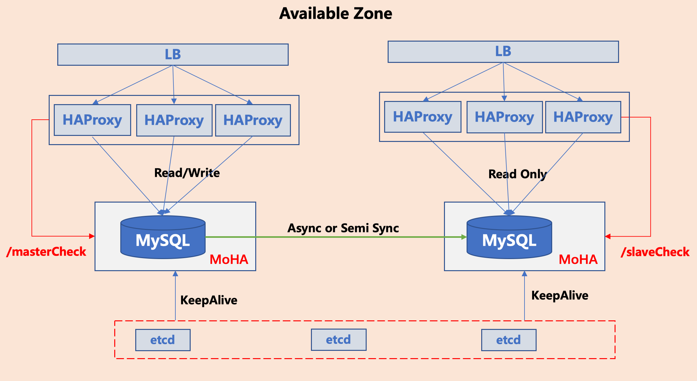
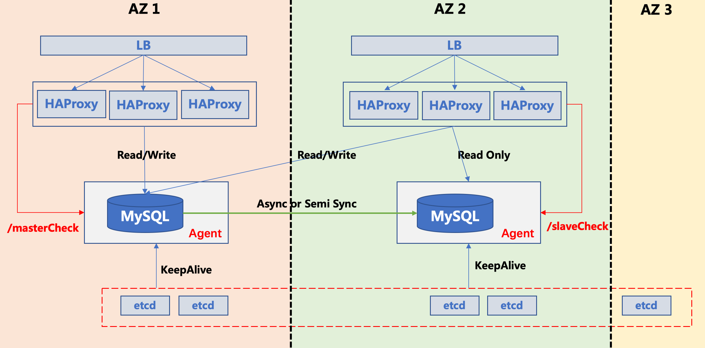

### What is Mobike High Availability(MoHA)? [中文](README-cn.md)

MoHA provides the high availability(HA) for cross-region MySQL clusters, 
by automating master failover and fast master switch.

- __High Availability__

    Master failure detection and automating master failover enables master switch in a few seconds.
    
- __Brain Split Prevention__

    By configuring proper lease ttl, MoHA enables at most one master in the cluster at any time.
    
- __Cross AZ Topology__

    Leveraging etcd as the service discovery, MoHA prevent its implementation from VIP,
    so that the cross-AZ MySQL cluster is able to be build via MoHA.

- __Multiple Standby__

    MoHA supports MySQL cluster with multiple standby servers, 
    and ensures that the server with latest log will be promoted during failover.
  
- __Single Point Primary Mode__ 

    When there is only one MySQL surviving in the cluster, 
    it is able to provide R/W services even if the communication to etcd is unstable or broken,
    which is called **Single Point Primary Mode**. MoHA enters and exits this mode automatically.

- __Manual Master/Slave Switch__

    Besides the automated failover, which is described below, MoHA provides the ability to switch master manually.

__MoHA is Supporting Mobike Databases in Production__


### Quick Start

#### Run in Production
Docker image is already available on [Dockerhub](https://cloud.docker.com/u/moiot/repository/docker/moiot/moha)

Latest image tag is  `v2.4.0`, run `docker pull moiot/moha:v2.4.0` to pull the image
 
config and start/stop scripts refers to [operation doc](docs/operation.md)

**Runtime Dependencies**
- [Docker](https://www.docker.com/) recommended with the latest version
- [etcd](https://coreos.com/etcd/) with version no earlier than 3.3.2 


**One AZ Example**



**Three AZs Example**


#### Download Source Code

```bash
cd $GOPATH
mkdir -p src/github.com/moiot
cd src/github.com/moiot
git clone <remote_repo> moha
cd moha
```

#### Development Environment Setup

```
make init
```
make init  does the following
- check and install `dep`
- check and install `golint`
- check and install `goimports`
- add git commit hook
- prepare testing framework

now you can do development on your local machine


#### Local Machine Running Environment Setup

```bash
make env-up
```

#### Create Local Machine Running Agents, AKA Test Code on Local Machine
```bash
make docker-agent
make start-agents
```

#### Local Machine Running Environment Destroy

```bash
make clean-data
```

### Roadmap
[Roadmap](docs/roadmap.md)


### License
This project is under the Apache 2.0 license. See the [LICENSE](LICENSE) file for details.

### Acknowledgments
* Thanks [rxi](https://github.com/rxi) for the lightweight log framework
* Thanks [juju/errors](https://github.com/juju/errors) for the error handling framework
* Thanks [yubai](http://oceanbase.org.cn/?p=41) for his Lease analysis
