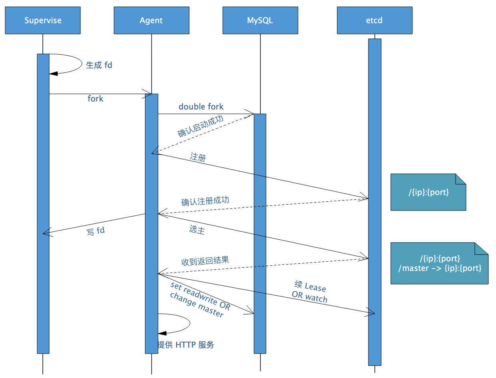
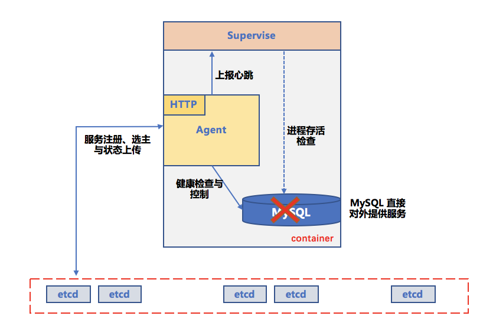
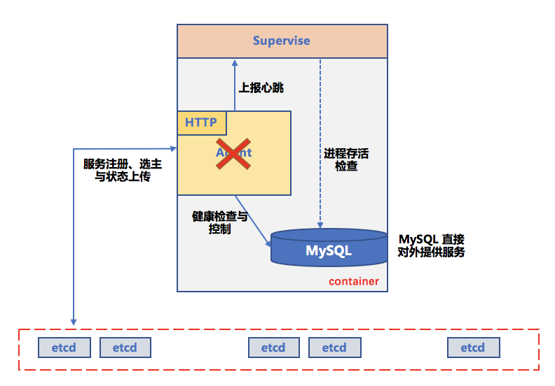
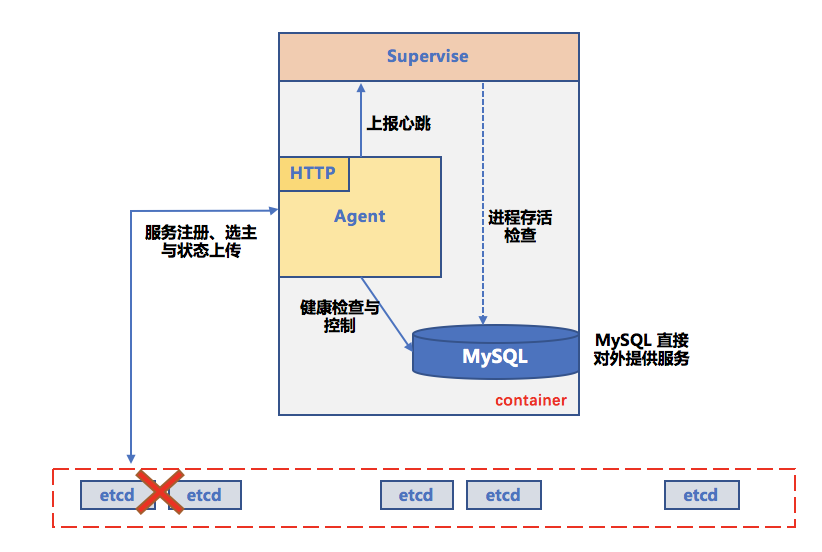

# 详细设计

### 设计思路
MySQL agent 在整个双活中的作用主要有两个：

- 通过 Lease 机制选主（Master）和保持 Master 节点的身份
- 通过 etcd 事件感知 Master 问题，并使用 set readonly 来实现 MySQL Master 身份的切换

整个过程中，agent 需要交互的对象有两个，即：

- agent 节点负责管理的 MySQL 实例
- 作为分布式基础构建的 etcd 集群

考虑到 MySQL 本身（agent 负责管理）也是一套集群，且需要考虑 etcd 和 agent 之间的网络通讯异常，在设计时考虑实现两套 Lease 机制

1. Node Status Lease：agent 和 etcd 之间通过 Lease 确认 agent 自身运行正常，并在 etcd 里更新当前节点的 Binlog Pos 最新位置
2. MySQL Master Lease：agent 和 MySQL 之间通过探活机制确认当前 MySQL 节点的运行状态，并通过 etc 的 Lease 保证 Master 的节点的选举和保持

### 详细设计
#### 结构
如下图所示，一个 docker container 里包括三个组件（进程），这些组件和他们的作用如下：

- __自研的 supervise 组件，容器内 pid = 1 的进程，负责__
    - fork 启动 agent 进程
    - 对 agent 和 MySQL 进程进行探活和相应处理 
    - 容器销毁之前的 tear-down 操作
- __agent 组件，负责__
    - 启动自检 OK 后向 supervise 开启的 FD 中发消息，使 supervise 知晓 agent 正常存活
    - double fork 启动 MySQL 或 attach 容器中已存在的 MySQL
    - 与容器内的 MySQL 和容器外的 etcd 集群进行交互
- __MySQL 组件，负责对外提供 MySQL 服务__

*Q：为什么需要 supervise 进程，只有 agent 和 MySQL 进程不可以吗？*

A：使用 supervise 进程主要有这几点好处

- supervise 只负责启动 agent、进程探活与相应处理，这部分逻辑提取出来避免 agent 更加复杂
- supervise 作为容器内 pid = 1 的进程，只要 supervise 结束，就可以确保容器内的 MySQL 肯定已经关闭。
    - 这样如果 Master MySQL 的 agent 一直无法启动，可以停止 supervise 进而终止当前的 Master MySQL，
防止 agent 不续约导致新的 Master MySQL 被选出后与当前容器内的 MySQL 形成双主，进而产生数据不一致。
    - 如果 agent 意外宕掉而 MySQL 功能正常，supervise 在 Lease 失效前成功拉起 agent ，整体服务不受影响。
- agent 的逻辑相对比较复杂，如果 agent 作为 pid = 1 的进程的话，如果 agent 意外退出会导致 MySQL 退出，
这样可能降低程序稳定性  

*Q：supervise 怎么对 agent 和 MySQL 探活？*

A：supervise 会打开一个 eventfd，agent 会定期向里面写，如果 supervise 一段时间接收不到数据则说明 agent 已经退出或 hang 住。
对于 MySQL 则是注册 `SIGCHLD` 的 handler 来处理，这样只会处理 MySQL 退出的情况，不会处理 MySQL hang 住，
因为 MySQL hang 住的情况比较复杂，我们在实践中是通过监控来发现并人工介入。

*Q：double fork 是指？为什么要 double fork 来启动 MySQL*

A：double fork 的意思是说，agent fork/exec 一个中间进程（intermediate process），之后这个中间进程 fork/exec MySQL 后自己退出。
这样做是为了让 supervise 来收养 MySQL 进程。这样只需要由 supervise 来处理 `SIGCHLD` 信号就可以了，实现更加简洁。

### 处理场景

#### 正常流程
1. agent 启动，确认 MySQL 进程已启动
2. 连接 etcd，向 etcd 发送心跳（With MySQL binlog pos），维护 Node Status Lease
3. 查看 MySQL 运行状态，触发抢主逻辑

    1. 成功，角色为Master
        1. set MySQL readwrite 
        2. 定期查看 MySQL 运行状态，更新 MySQL Master Lease
    2. 失败，角色为Slave
        1. set MySQL readonly
        2. 建立和主节点的同步关系
        3. Watch etcd 上主节点的信息

#### 启动时序

#### 计划内切换

计划内切换需要 **保证 binlog 同步** 后再切换。

__Master__
1. set Master readonly 
2. 等待 Slave 追上。设定一个超时时间，如果在这个时间内 Slave 还没追上的话就终止切换，set Master readwrite
3. delete etcd 上注册的 Master 节点信息（重新触发新一轮的选主流程）

__Slave__
1. Watch Master，发现 Master 被删掉，开始选主
2. 成功抢到 Master 后 set MySQL readwrite

#### Failover

每个组件都有可能出现故障，mysql-agent 要保证的是 
1. 集群在最短时间内回复读写能力
2. 集群在同一时间最多只有一个 MySQL 可写，以防止因为脑裂而导致的数据不一致。

下面根据每种故障来介绍 mysql-agent 的 Failover 逻辑

- __Master MySQL 挂掉__

    
    1. 当 Master 的 MySQL 意外退出时， supervise 会检测到并退出容器，进而 Lease 续约停止 
    2. K/V 消失 
    3. 存活的 MySQL 会触发新一轮选主并保证有且只有一个成为新的 Master

    
- __mysql-agent 挂掉__

    
    1. 当 Master 的 agent 意外退出时，supervise 会检测到并重新启动 agent，对集群无影响
    2. supervise 重启 agent 失败后退出，终止容器。MySQL 实例随之被销毁，防止双主
    

- __MySQL 和 agent 都挂掉__
    - 处理同 MySQL 挂掉 
    
- __etcd 宕机或重启__ 
    
    
    - 当 etcd 故障/重启时，在 Lease 过期之前，MySQL 可以正常提供服务；
        1. 如果 Lease 过期之前 etcd 已恢复，无影响
        2. 如果 Lease 过期之前 etcd 未能恢复，Master MySQL 退出，整个集群只提供读服务
    - 调优 Lease 的时间，保证 etcd 在计划内重启的时间内 Lease 不会过期

- __Master agent 和 etcd 网络隔离__
    
    
    - 当 Master 与 etcd 网络隔离时，Master agent 续 Lease 会失败。Lease 过期则会触发新一轮选主。
    - 如果能在 Lease 过期前确保 MySQL 服务已经被停掉，那么可保证集群内最多只有一个 Master 提供写服务
    - mysql-agent 采用一种方法来保证 Lease 过期前 MySQL 服务已经被停掉，实现细节可参见 [Lease 机制介绍与 Lease 时间确定](lease.md)
