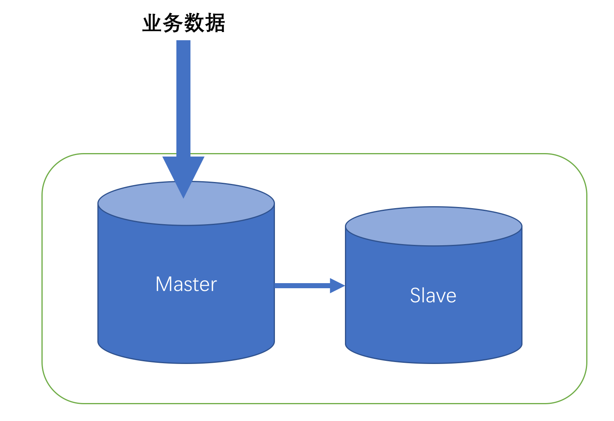
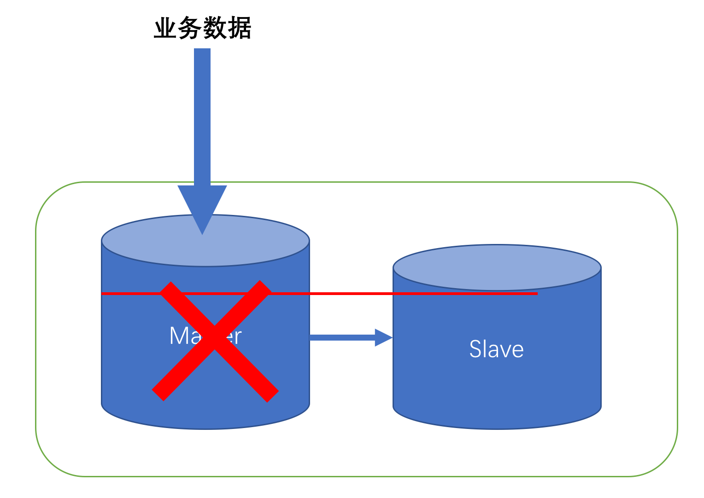
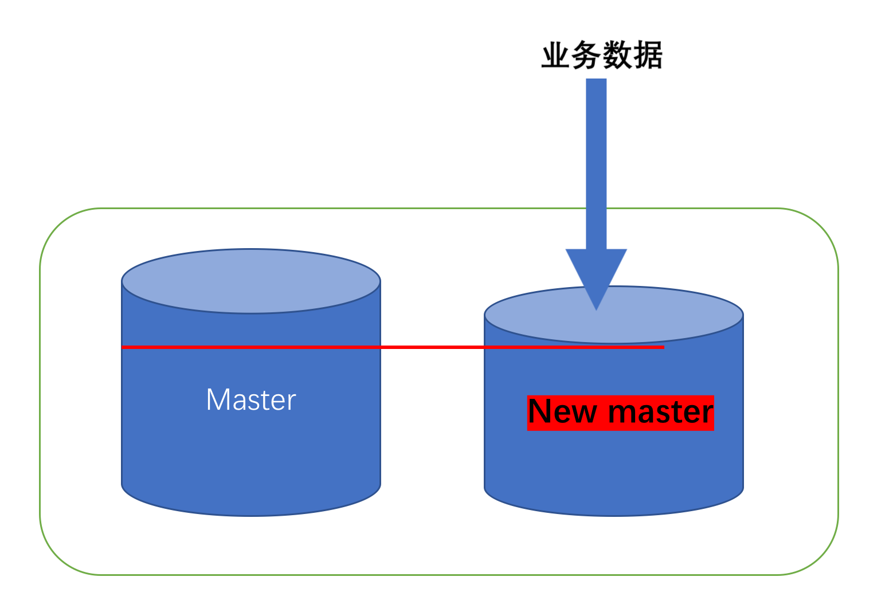
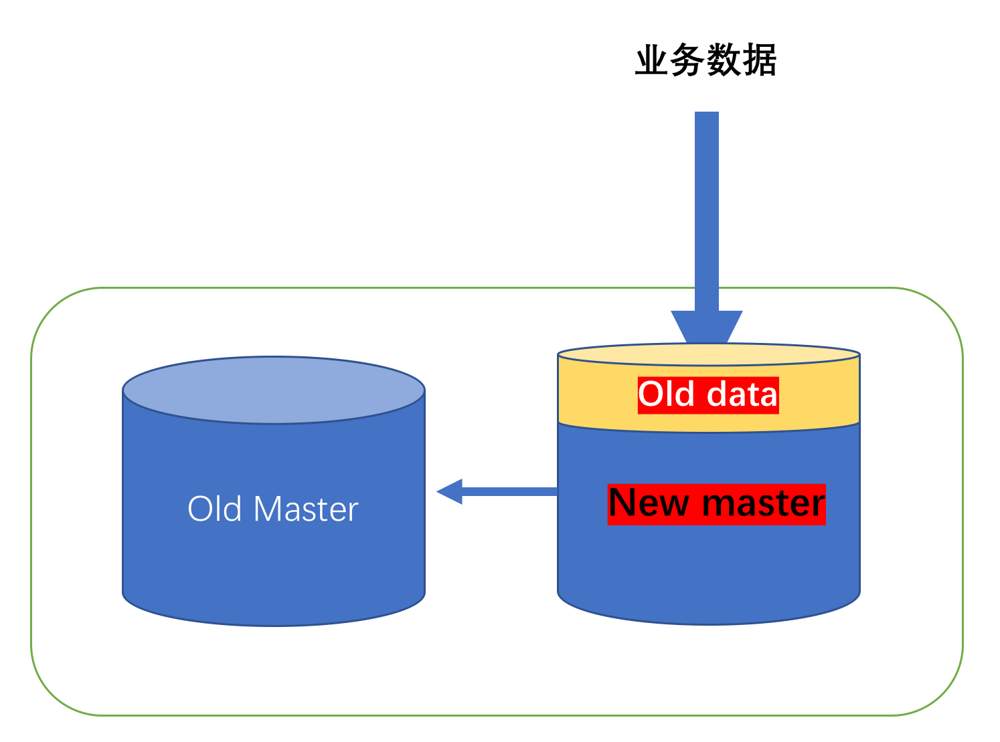

## 运维指导

MoHA 的发布是基于 MySQL 的 docker 镜像，所以发布的是 `moiot/moha:<tag>` 的镜像格式

目前最新版可通过 `docker pull moiot/moha:v2.4.0` 获取。
使用公开发布的镜像可以跳过下面的**基础镜像配置**。

### 基础镜像配置
如果想在本地进行镜像打包，可以参考下面步骤。

**第一次**打包镜像的时候需要执行下面命令，配置基础镜像
```bash
docker pull gcc:8.1.0
docker pull golang:1.11.0
docker pull quay.io/coreos/etcd:v3.3.2
docker build etc/etcd-image/v3.3.2/ -t moiot/etcd:v3.3.2
docker build etc/mysql-image/5.7.22-pmm/ -t moiot/mysql:5.7.22-pmm
```

之后可以执行 `make release` 查看指导

执行 `python release.py {version}` 就会在本地的 repo 打一个名字为 "{version}" 的 tag 并推送到 git 仓库。
如果 repo 是 gitlab 的话会执行 CI 来 build 镜像并 push。详情可见 [.gitlab-ci.yml](../.gitlab-ci.yml)
否则需要手工执行
```
    # 编译
    make docker-agent
    # build 镜像
    docker build -t $docker_image ./etc/docker-compose/agent
    # 上传镜像至仓库
    docker push $docker_image
    # clean up
    docker image rm $docker_image
    docker image prune -f
```

### 部署
因为 agent 是基于 docker 的，所以部署时只需要 
* docker-compose 文件，用来启动容器
* config.toml 文件，agent 的相关配置
* my.cnf MySQL 的配置文件

即可。可以参考 [etc/docker-compose/deploy-example](../etc/docker-compose/deploy-example) 的例子。

#### 单机房部署
MoHA 支持单机房部署，下图是以一主一从两个 MySQL 为例。


#### 多机房部署
MoHA 也支持多机房部署（多活架构），下图是以三个机房为例部署一主一从的 MySQL 集群。


#### 依赖
agent 依赖 etcd，可以参考 [https://coreos.com/etcd/](https://coreos.com/etcd/) 
来安装和运行 etcd。**etcd 的版本需要大于等于 3.3.2**。

agent 也依赖 docker，**docker 的版本最好大于等于 18.06.0-ce**。 

#### 运行
在 docker-compose.yml 的目录下执行 `docker-compose up -d` 。

#### 监控
agent 内置了 [pmm-client](https://www.percona.com/doc/percona-monitoring-and-management/index.html)。
如果已有 pmm-server 的话可以执行  
```
	docker exec <agent-container> pmm-admin config --server <pmm-server-ip>
	docker exec <agent-container> pmm-admin add mysql --user <username> --password <password> <mysql-instance-name>
```
将 MySQL 加入 pmm-server 的监控。
如果没有 pmm-server 可以参考 [etc/docker-compose/docker-compose.yaml](../etc/docker-compose/docker-compose.yaml)
里面的 `pmm-server` 进行搭建。

agent 的监控可以通过修改 pmm-server 内的 prometheus 配置进行添加。具体步骤可以参考
[Makefile](../Makefile) 的 `monitor` 部分。


#### 执行主从切换
agent 提供以下的 HTTP 服务
* `/changeMaster` 主从切换
* `/setReadOnly` 将当前节点的 MySQL，如果是 Master 的话，设为只读
* `/setReadWrite` 将当前节点的 MySQL，如果是 Master 的话，设为可读写

主从切换需要先执行 `/setReadOnly`，如果可以进行主从切换，则执行 `/changeMaster`，
否则执行 `/setReadWrite` 使集群恢复可读写。
具体步骤可以参考 [tool/switch.go](../tool/switch.go) 

### 计划外主从切换发生后的人工介入

1. 正常运行的时候，业务数据写入主库，从库在同步的时候可能会跟主库有一定的数据延迟


2. 当主库宕机的时候，水平红线上面的数据从库还没有同步


3. Failover（计划外主从切换）发生，从库成为新的 Master，业务数据向新的 Master 写入，但是红线上的数据依然只存在于旧主库


4. 人工介入:
   1. 将旧主库红线以上的数据 dump 出来_
   2. 将旧主库的这部分内容截断（truncate）
   3. 将旧主库加入集群作为新从库
   4. 之后把这部分数据 append 到新主库上去



*怎么知道 Failover 的时候主从的数据差异呢？*

在主从切换时，etcd 上的 `{prefix}/switch/{timestamp}` 会记录切换时新主库的位点信息，可以以此为准。


*如何截断旧主库多出来的数据呢？*

可以使用 MySQL 的 flashback 工具，比如 [MyFlash](https://github.com/Meituan-Dianping/MyFlash)


*这部分数据怎么 append 到新主库上去呢？*

这部分数据是以 binlog 格式 dump 出来的，需要使用 binlog 重放工具。